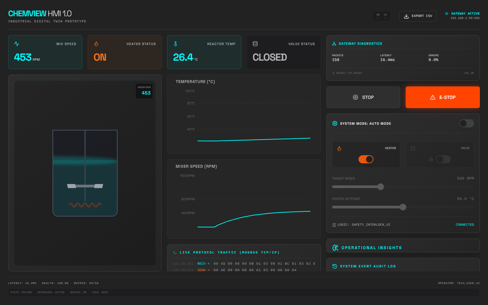

# ChemView

ChemView is an open-source industrial HMI and digital twin prototype for a chemical mixing process. It demonstrates how modern web tooling can model telemetry, operator controls, communication traces, and safety interlocks in a single interface.



Portfolio case study: [senanur-cetin.vercel.app/projects/chemview](https://senanur-cetin.vercel.app/projects/chemview)

Portfolio role: `archive proof`

## Why it sits in supporting evidence

ChemView is kept as supporting evidence for industrial UX, HMI state modeling, and telemetry interface design. It strengthens the portfolio visually and product-wise, but it is not meant to compete with the lead case studies for Data + AI roles.

## What it does

- Runs the mixing-tank simulation **on the server** (physics, safety interlocks, simulated Modbus register map) and streams a snapshot to the browser every second over Server-Sent Events.
- Visualizes operator controls, trends, and the Modbus wire log in one HMI layout.
- Enforces safety interlocks server-side: the mixer cannot start with the discharge valve open, the valve cannot move while the rotor spins, E-STOP always wins and is never rate limited.
- Raises deterministic rule alarms immediately, and layers optional Gemini (Genkit) commentary on top when `GEMINI_API_KEY` is set. The LLM never gates a safety decision; it is rate limited, time boxed, schema validated and falls back silently.
- Persists telemetry, alerts and the audit trail (Firestore when configured, bounded in-memory otherwise) and serves `/api/history` and a CSV export at `/api/export`.

There is still no real PLC: the Modbus layer is a deterministic simulation, not a network client.

## Stack

- Next.js 15 (App Router, Route Handlers) and React 19
- TypeScript, Tailwind CSS, shadcn/ui, Recharts
- Genkit and Gemini for AI-assisted alert commentary
- Firebase Admin (Firestore) for optional persistence
- Vitest for unit tests

## Local setup

```bash
npm install
cp .env.example .env   # optional: GEMINI_API_KEY and FIREBASE_* values
npm run dev
```

The app runs on `http://localhost:9002`. Without any keys it works fully, using rule alarms and the in-memory store.

Quality checks (also run in CI): `npm run typecheck`, `npm run lint`, `npm test`, `npm run build`.

See [docs/architecture.md](docs/architecture.md) for how the pieces fit together.

## Portfolio note

ChemView is supporting evidence for industrial UX, state modeling, and operator-centered full-stack architecture rather than production PLC integration.

## License

MIT
